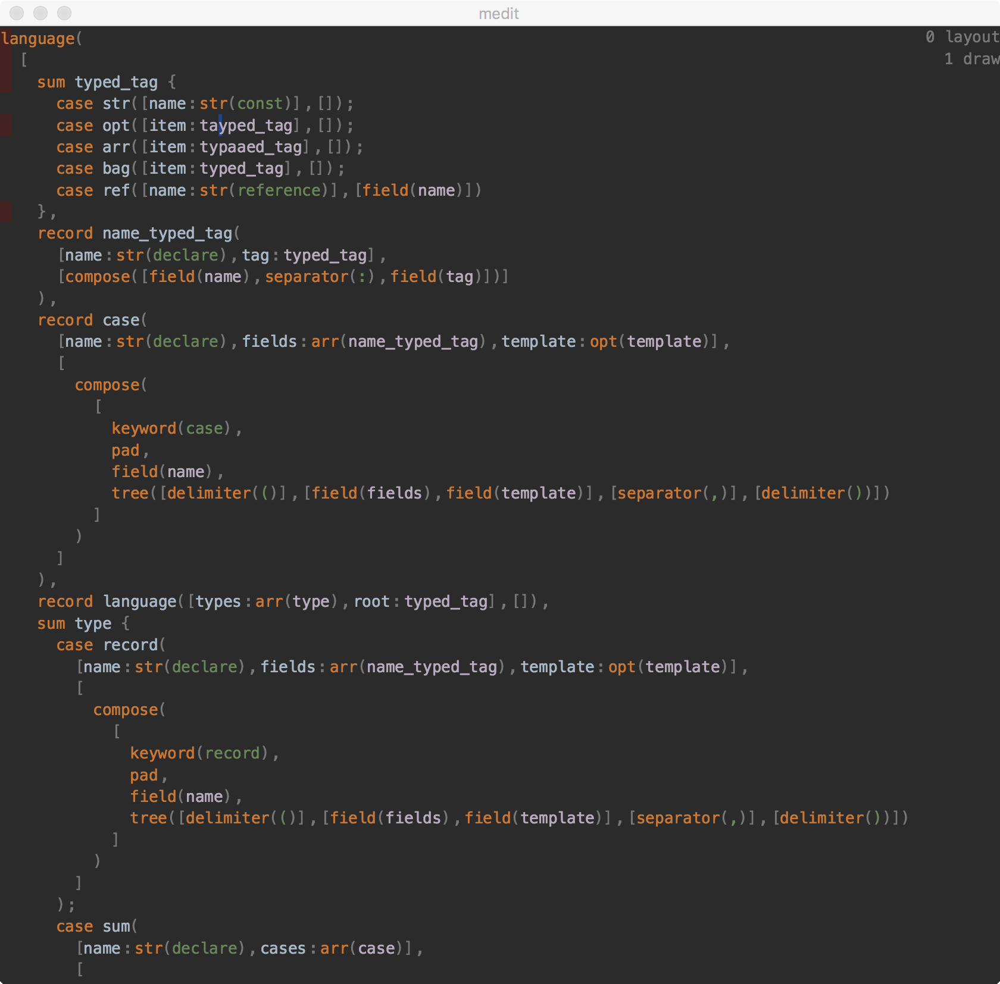

1. [A Bootstrapped Tree Editor](05-growing-a-structural-editor.html)
2. [Layout Combinators](06-growing-a-structural-editor-02.html)
3. [Handling Mouse Clicking](07-growing-a-structural-editor-03.html)


In the last post, we didn't say how exactly we go from `Frag` to pixels. One problem is because we want to support `LineFrag.Text` with different text sizes, we need to align texts in one line by baseline.

After some experiment, the implementation is the most simple one:
```scala
class Line(pad: Float, items: Seq[LineFrag.Text])
class Page(lines: Seq[Line])

case class Pos(line: Int, cursor: Int)
```

Then each line can be measured. Then drawn.
 
During measuring, each frag will cache it's start/end position in the page using type `Pos`. This way from pixels in screen, we can easily lookup which line and `LineFrag.Text` is user pointing to, and then from information in `Frag` we can get which fragment does it corresponds to.

As we said before, the algorithm to line break is incremental. We also try to make sure we don't produce `Line` when unnecessary by caching `Frag` which corresponds to entire lines.

Lines starts with red color is lines needs to be redrawn when the text at the cursor is changed, most line is cached so layout after small text edit is super fast:



-------

Before this change, I tried to work directly with `Frag` and give each `Frag` a position relative to parent `Frag` and width and height, and draw directly using these information. This creates overly complicated and fragile code. So I guess the most direct way to program something is almost always the best.

[Project source code](https://github.com/molikto/medit).


