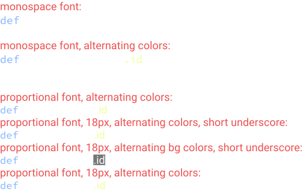
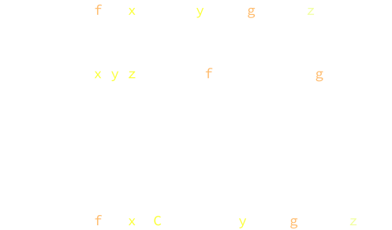

* [Memory layout and staging part 1: type-passing polymorphism, two-level type theory introduction](https://www.youtube.com/watch?v=OmNqXP9Hp_A&t=1725s)
  * only watched the first part
* ordered packages for programming languages
  * take a look at [Lean mathlib](https://github.com/leanprover-community/mathlib/tree/master/src), I wish these packages are ordered like a math book chapters, by dependency relations
  * it is misfit for using folders and files to represent packages
  * the files of a project should be acyclic, [lihaoyi/acyclic for Scala](https://github.com/lihaoyi/acyclic), we should be able to linearly order all files in a project automately
  * but I think it is not so ok to require folders to be acyclic, so we cannot automately reorder folders
  * but still, I think each package should have a z-index, and there should be a linter to suggest reorderings based on dependency
  * it is like my idea of language syntax based on rich text (nolex) instead of plain text, there are some similar design principle: the difference between editing stage and elaboration stage, and doing more stuff at editing stage enables more possibilities
* Why I am not using Lean but doing my own stuff?
  * I don't like universe variables, I wonder if lifting will work?
  * I have some my own ideas on how to have a more natual syntax for math (see above), but arguably one should try improve upon Lean instead do your own.

## Syntax

* trying out Lean4. I don't understand why `camelCase` is prefered
  * it is ugly to write `idComp` and `compId`, the symmetry of `IdComp`/`CompId` or `id_comp`/`comp_id` is lost
  * there are eligibility issues with `snake_case.property`, because for me it looks like `snake` and `case.property`. but they can be mitigated:  
    
* I also made a demo of my old idea, color coded syntax for introducing implicit variables, the two color bellow introduces normal variables and implicit variables:
    
  * for code in plain text (which is the case for all popular PLs), you can have elaboration rules like [Auto Bound Implict Arguments](https://leanprover.github.io/lean4/doc/autobound.html#auto-bound-implict-arguments), but as said in that page "some users may feel uncomfortable with it"
  * if we have rich text as source code, then we can require user to use color codes to represent implicit variables, or better, the "auto bound implicit arguments" rule is enabled only for currently opened editor, and elaborator is allowed to add the color code to the source code
    * no more editing is performed by the user, the user type the same amount of keys
    * and the information saved in the source code is explicit, not implicit using very complex elaboration rules
  * for plain text, an alternative syntax for implicit arguments will do: `def comp: (f: #(x: C) → #y) → (g: y → #z)` where `#x` introduces a implicit argument, and `#(x: C)` introduces a implicit argument with type annotation